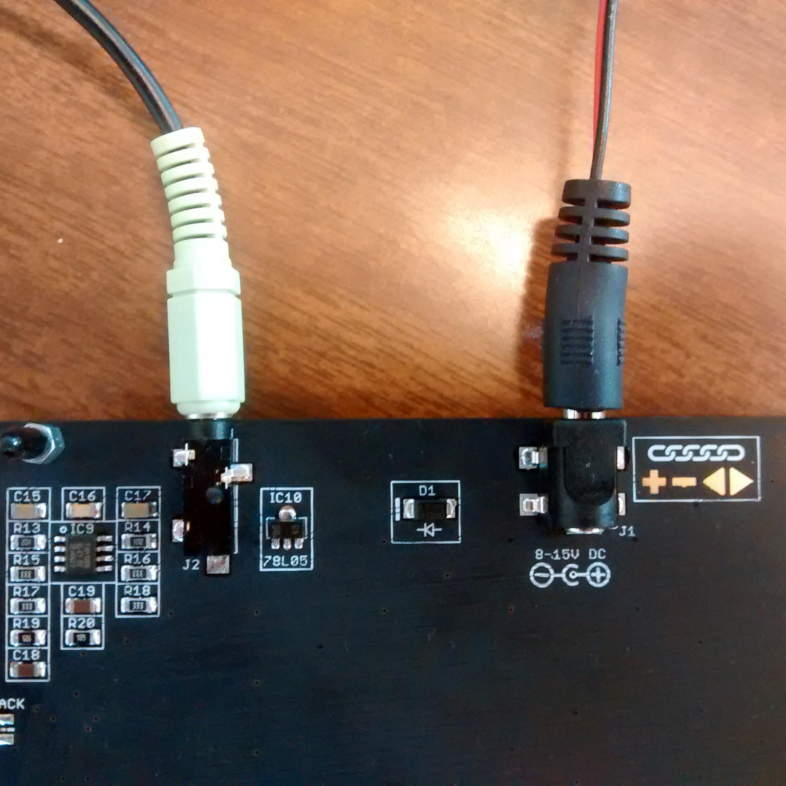
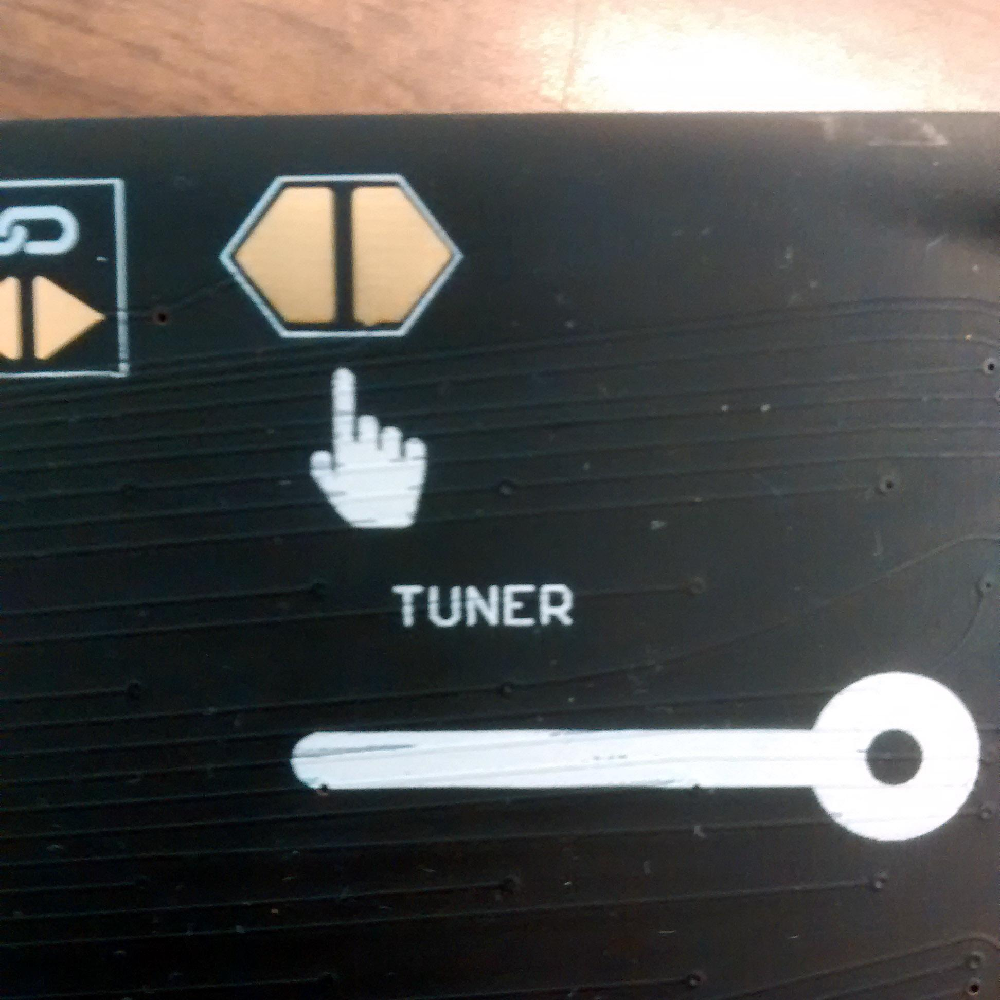
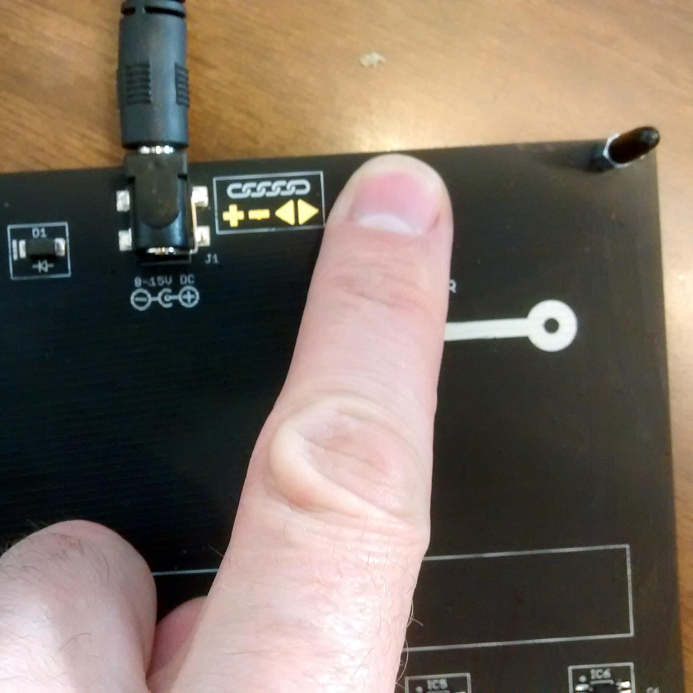
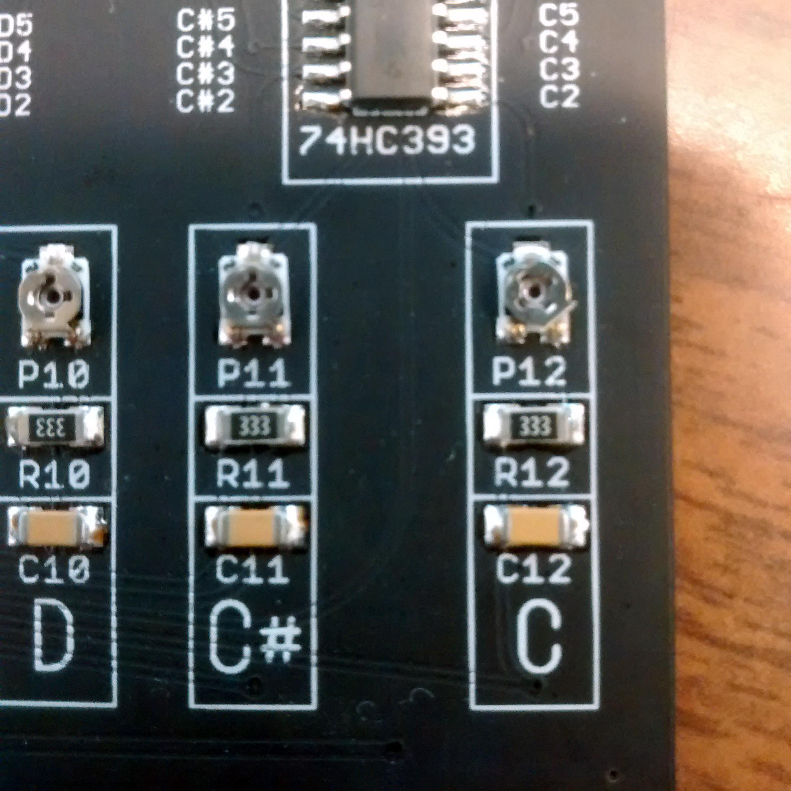
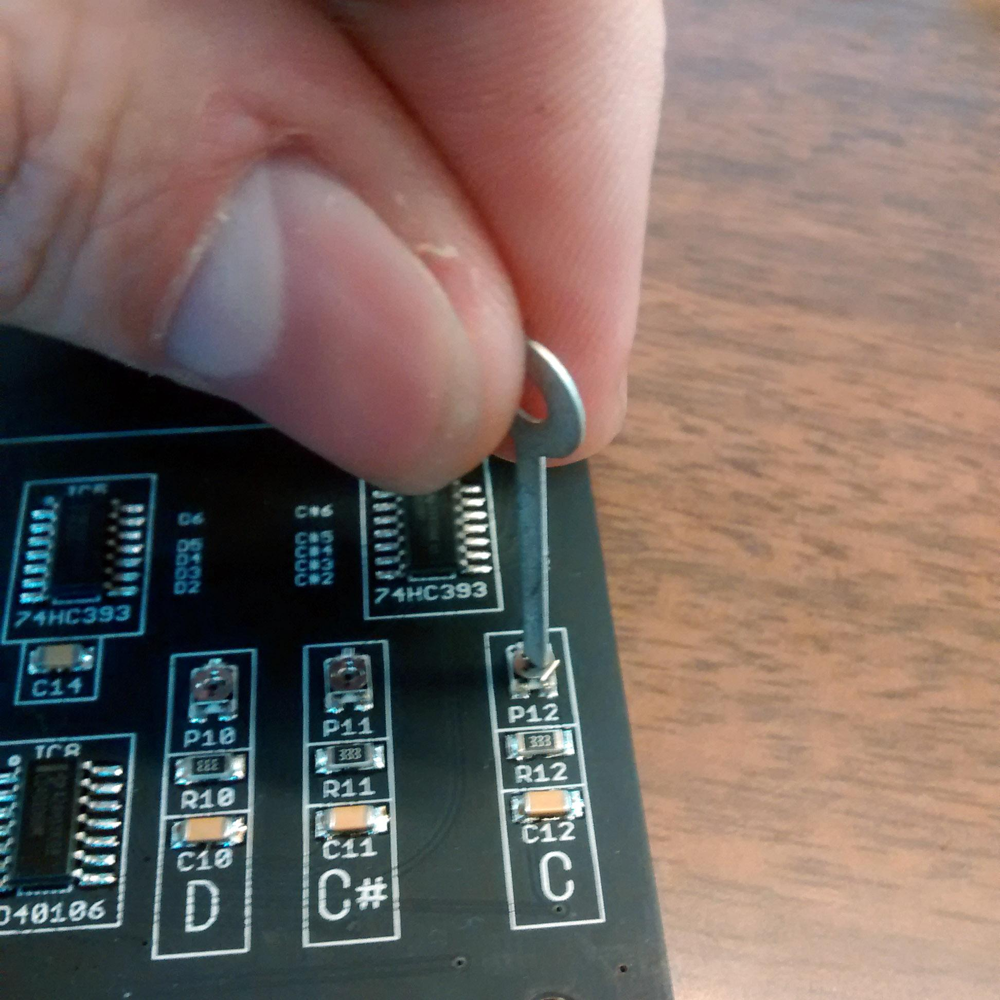

# Hyve Synth Tuning Procedure
**By Skot Wiedmann**

1. Plug in power and audio out on your Hyve. Make sure you are using a fresh 9V battery to power the Hyve Synth. Listen to the audio with headphones plugged directly into the Hyve Synth.
 
2. Play a reference tone to guide your tuning. Click on the note names below to play the tone of the note you are tuning. It helps to do them in this order 
# **[B](1-B.wav) - [A#](2-Asharp.wav) - [A](3-A.wav) - [G#](4-Gsharp.wav) - [G](5-G.wav) - [F#](6-Fsharp.wav) - [F](7-F.wav) - [E](8-E.wav) - [D#](9-Dsharp.wav) - [D](10-D.wav) - [C#](11-Csharp.wav) - [C](12-C.wav)**
3. Touch the hexagonal tuning point on the upper right of the back of your Hyve
 
4. Use the tuning tool to **gently** turn the tuning screw associated with the note of the reference tone you are playing
 
5. Repeat for all notes until they match each reference tone. You can go back through all the notes and tweak them a few times to dial in more precise tuning. 
